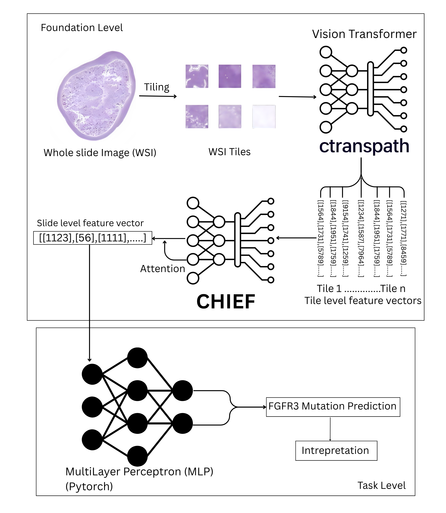

## Identifying Cancer Subtypes through FGFR3 Mutation in Bladder Cancer using Histopathological Images
### Abstract
Bladder cancer is the 10th most common form of cancer, accounting for 550,000 newly diagnosed 
cases and 220,000 deaths globally. Since Bladder cancer is highly heterogeneous, it is important 
to identify the subtype of the cancer for targeted treatment strategies that lead to better outcomes.  
Based on the invasive nature of the tumor, Bladder cancer can be subtyped into Non-Muscle 
Invasive Bladder Cancer (NMIBC) and Muscle Invasive Bladder Cancer (MIBC).  With advances 
in sequencing technologies, several studies have reported that the Fibroblast Growth Factor 
Receptor 3 (FGFR3) mutation is highly frequent in NMIBC and very rarely seen in MIBC. 
Therefore, identifying the mutation earlier can lead to faster determination of the cancer subtype, 
which helps in treatment directions. However, in reality, the identification of the FGFR3 mutation 
is highly reliant on expression studies, such as RNA sequencing, which require a significant 
amount of time and effort. In this study, we examined whether it is possible to identify the FGFR3 
mutation in routinely collected Histopathological Whole Slide Images (WSI) of bladder cancer 
using deep learning. To achieve this, we utilized pre-trained foundational models based on the 
Vision Transformer architecture. These models have been trained on thousands of 
histopathological images obtained from several cancers to learn general, high-quality feature 
representations in the form of vectors. By using these vectors as base features, a Multi-Layer 
Perceptron (MLP) neural network is created to model the relationship between the FGFR3 
mutation and the images. The model achieved an average Area under the curve (AUC) of               
0.81 (+/-) 0.068 across 10 different trials, indicating that there are visual features in the images 
that help identify the presence of the FGFR3 mutation. Interpretive visualizations were then 
created to understand the model and examine intra-cancerous heterogeneity between both 
mutation-present and wild-type classes, which showed that cancerous regions play a vital role in 
differentiating between the FGFR3 mutation and wild-type classes. 

    

The Tiling and feature extraction are done using the Ctranspath feature extractor in [STAMP] (https://github.com/KatherLab/STAMP)
The [CHIEF] (https://github.com/hms-dbmi/CHIEF) Foundational model is used to aggregate the tile-level features to the slide-level features.
The aggregation and important tile visualization is incorporated from [EAGLE] (https://github.com/KatherLab/EAGLE)
